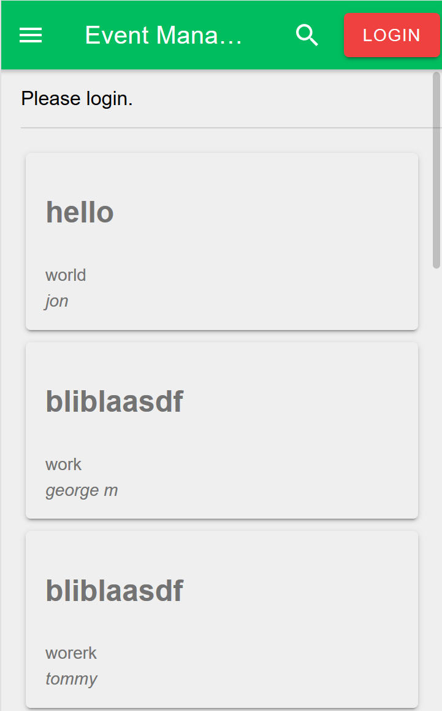

<h1>Report nr.4 of Team 4 for the 27th of November</h1>
<h2>Frontend:</h2>
Improvements have been made on the frontend side. First and foremost the ionic cards look 
much more pleasing to the eye:  

<h3>Problems:</h3>

<h2>Backend:</h2>
<h3>Problems:</h3>
