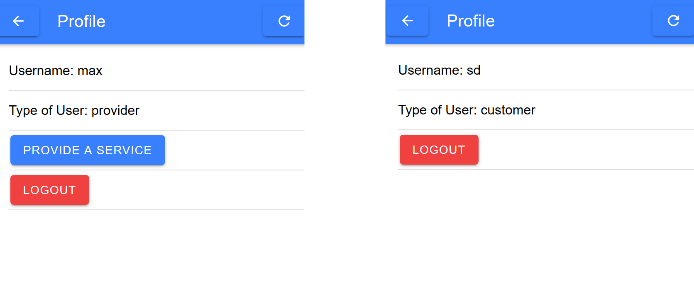

<h1>Report nr.3 of Team 4 for the 13th of November</h1>
<h2>Frontend:</h2>
The Frontend tried to work on the cards for the offers from the providers.
We figured out two prototypes. One for the web application <b>image 1</b> and one for the mobile application <b>image 2</b>. 

 
To make the development easier we made it so that the home page tells you whether you're logged in and as who you are logged in.
So let's say you log in as Max a provider then the homepage tells you: Logged in as Max a Provider.
If you aren't logged in as anyone it just says logged out.
 
We also made it so that once someone is logged in the login button turns into a profile icon from which you can go to your profile page once clicked on. 

<h3>Problems:</h3>
We couldn't implement pictures in the cards. We discussed this problem and we agreed, that there are only gonna implement a few default pictures to describe the offers. 
The design of the web/mobile application still lacks appeal. This is okay. We discussed that we are focusing on the main functionality first, before extending the graphical design.
We had to implement a refresh button to update certain elements, otherwise you would have to refresh the entire page every time.
<h2>Backend:</h2>
It's now possible to log into our application and differentiate between user types. you can see this in the picture below:
 

 
Session Tokens were the biggest step made by the backend team.
Now everytime someone logs in a session token gets created and allows the user to stay logged even after exiting our programm.
Without them the login into our application wouldn't even be possible.  
We also started to create a Database for the offers. There are create and delete methods.
<h3>Problems:</h3>
We started to test. Unfortunately it's no yet functioning as we expected it to do.  
The get-Methods for the Offers-Database don't work as expected. We are currently working on it.
