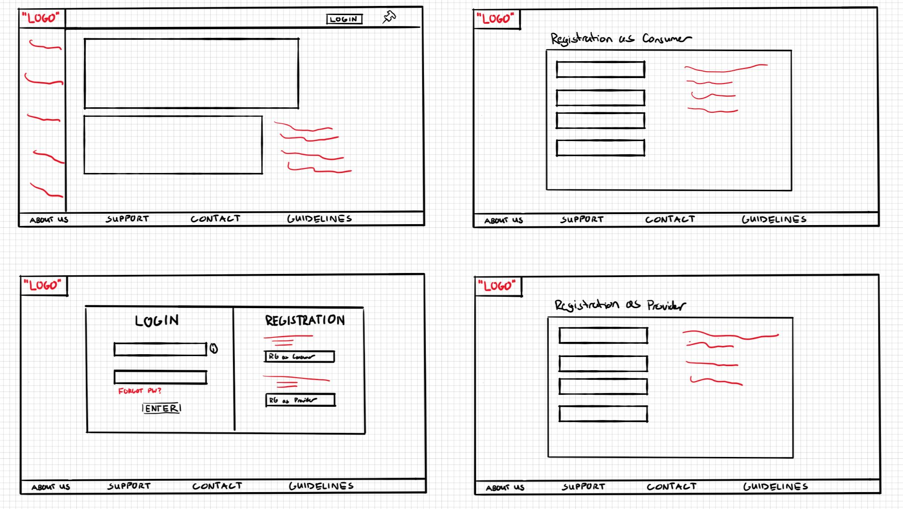
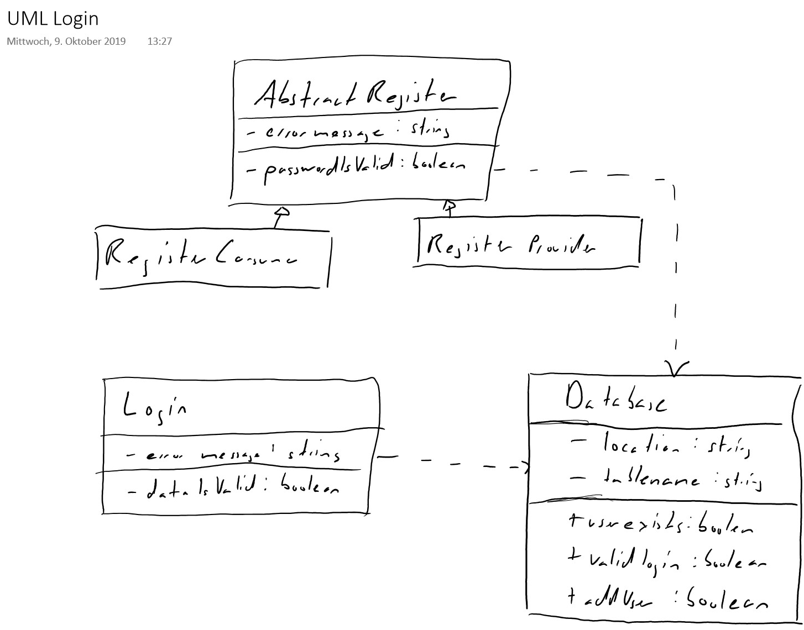

<h1>Report nr.1 of Team 4 for the 16th of october</h1>
<h2>Frontend:</h2>

The frontend team has a concrete plan of how the application should 
look but turning these ideas into code has proven rather difficult. 
This is because nobody from the team has worked with either ionic
or angular before. They will have to put in much effort, if
they don't want to fall behind.

A few components have been made for the frontend part of the 
application.
<ul>
<li>The login component,  
which holds the login input fields in one half of the grid
and the different registration options in the other half. 
It looks similar to the bottom left drawing in the following image.
</li>
<li>The register component,  
which contains the input fields that a user
has to submit as to receive an account. 
these should look like the drawings on the right side.
</li>
<li>The side menu component,  
which should take care of the navigation between different 
parts of the application.
</li>
</ul>

After the first week a paper prototype sketch was provided by the
frontend team as to how they imagined the application should look:

The frontend team is currently having trouble with the menu and how
routing/navigation works inside ionic applications

<h2>Backend:</h2>

The backend team created an account database-class from which
the consumer and provider classes will inherit from. 
Since consumers and providers are both essentially just
users with different requirements you can filter out the 
common parts between the two as to eliminate duplicate code. 
This will make it easier to create additional user types 
in the future, if it is needed.

They also created a database component with the corresponding 
services. This component makes communication between front and 
backend possible. 
It can submit HTTP requests to the backend
and organize data from the backend into a table, 
which makes viewing the data a lot easier for us.

The frontend team provided a rough sketch of how the backend 
should be structured in the form of an UML diagram 
after the first week.

The backend team has reported having trouble understanding 
how inheritance works between express controllers.

