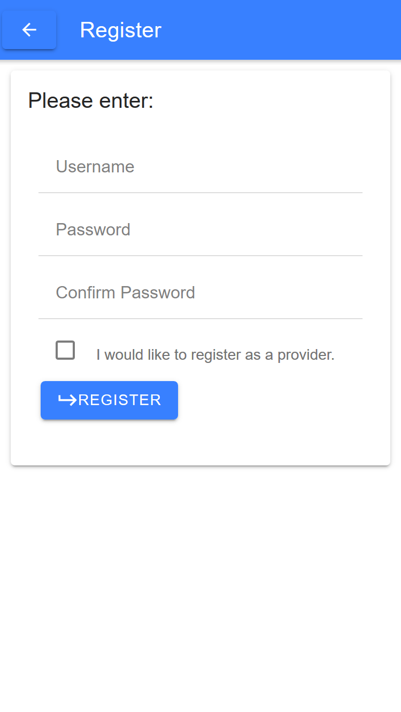
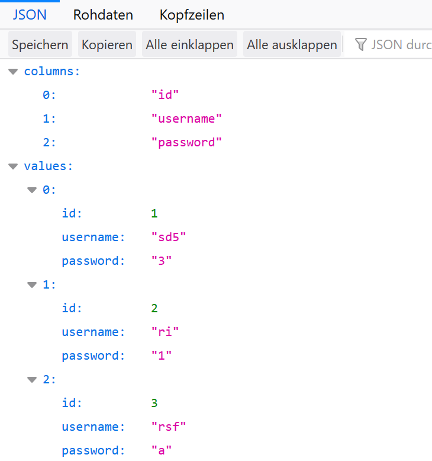

<h1>Report nr.2 of Team 4 for the 30th of october</h1>
<h2>Frontend:</h2>
The frontend has made substantial progress in their endeavors.
They managed to understand how the routing works in (angular) and created
multiple pages.  First and foremost the home page <b>image 1</b>, 
which consist of placeholder cards, a menu and a login button, that leads to the login page.  
The login page <b>image 2</b> consists of a grid with 2 cards. 
A card that holds the login field on the left and a card with a button, that leads to the registration, 
on the right. There is also a button, that allows you to choose to be a provider 
The registration <b>image 3</b> consists of a single card with 3 input fields.
The login, the password and a repetition of the password. 

<h3>Problems:</h3>
The cards on the homepage are still very basic and the design in general lacks appeal.
<h2>Backend:</h2>
The backend team made a lot of progress as well. They managed to connect the frontend to the backend,
so now you can pass the users inputs into their respective databases. With that
it is now possible to register with the registration page and login with the login page. 
Once a correct username and password are entered "Login successful" appears underneath. 
They also made multiple requirement checks, so that for example a username wouldn't be registered 
twice or that the password field wouldn't be left empty. 
Another addition is that now you can easily get an overview of all the customer and provider data on 
<a href="">http://localhost:3001/customer/</a> and respectively at 
<a href="">http://localhost:3001/provider/</a> This then looks like the image below. 
 
<h3>Problems:</h3>
Although you can now register and authenticate yourself, we still do not understand how to 
create a session, so that a logged in user could actually do something once logged in. Currently
we are trying to do this with json session tokens but that is easier said than done.
