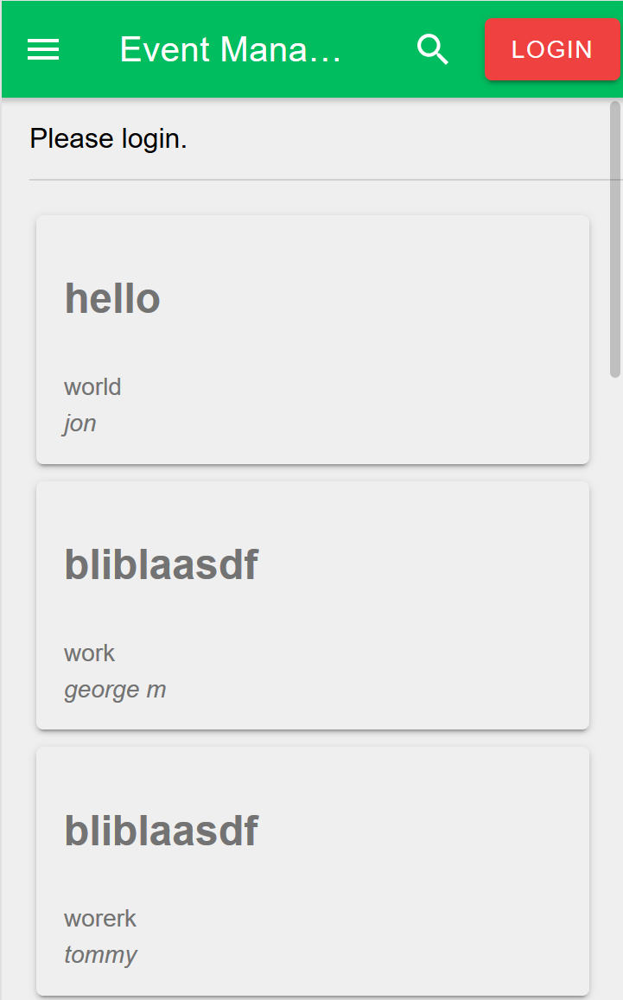
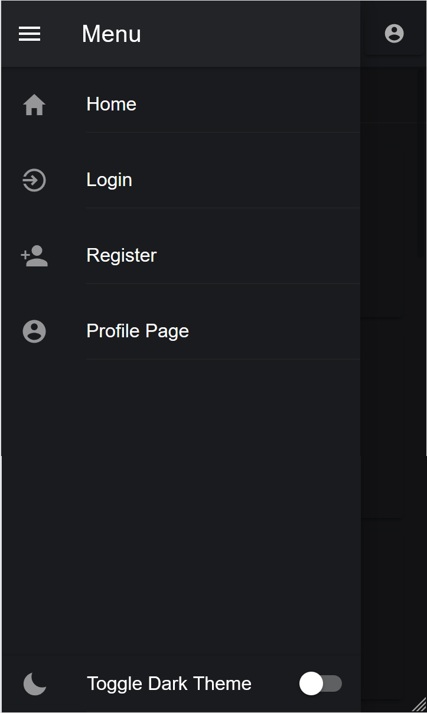
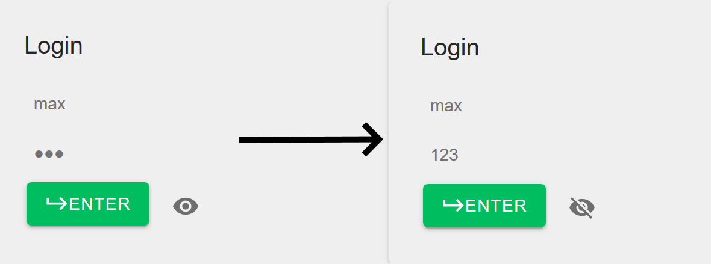
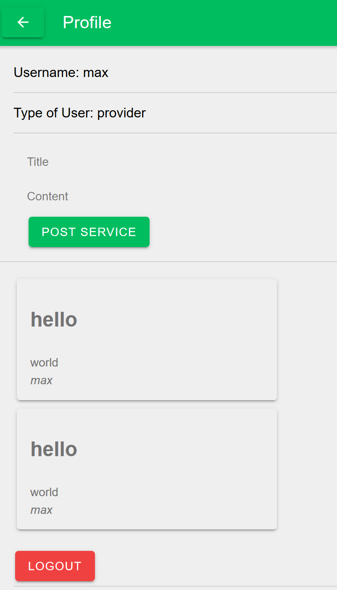
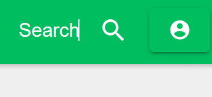

<h1>Report nr.4 of Team 4 for the 27th of November</h1>
<h2>Frontend:</h2>
Improvements have been made on the frontend side. First and foremost the ionic cards look 
much more pleasing to the eye, as seen in picture 1. Now the login has an eye icon that 
once clicked on makes the password visible, as seen in image 3. This should improve the 
usability and has also been added to the register component. Finally we added a dark mode,
since it was surprisingly simple to do. Image 2.  

<h3>Problems:</h3>
The way our app looks in ios has gotten better, but it still has many problems.
The offer cards still need some work and they don't really provide any crucial information.
The dark mode isn't fully integrated, although this is the least of our worries. 
<h2>Backend:</h2>
The Backend team made many improvements since the last report. They fixed the problems they were facing before
with the reloading of the data and have improved since. It is extremely simple to post offers
to the home page now. All you have to do is, go to your account, enter the data and press post, 
you can see this in Image 4. 
The offer will then proceed to appear on the home page.
Each user can now see, which posts he's made inside of their Profile page as well. We also implemented a search 
bar on the header with which you can search through the posts, This can be seen in Image 5. 

<h3>Problems:</h3>
Currently the search bar only looks for username's and can't look for titles. 
We have to implement images into the posting system, since otherwise the offers look lifeless.
Deleting the post has to be a possibility as well for each user.
